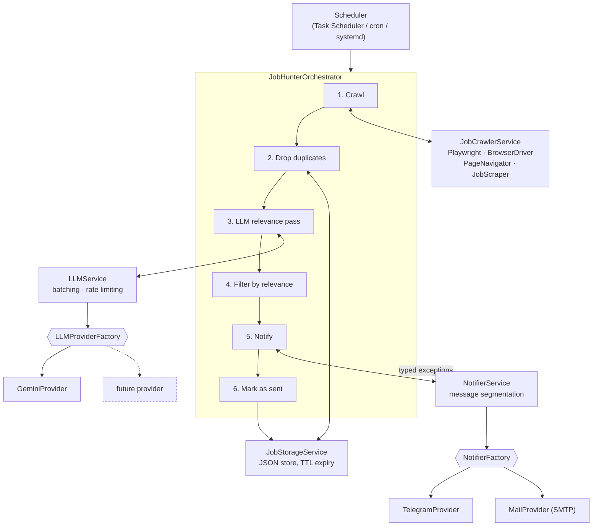

# JobHunter

An unattended job-search pipeline. It crawls company career pages on a schedule, asks an LLM to judge each listing against your criteria, and pushes the matches to Telegram or email. Written in Python, runs in Docker, and is built so the LLM and the notification channel are swappable without touching the pipeline.

Built because checking eight career sites by hand every day is a loop, and loops belong in code.

---

## Architecture

The application is a six-phase pipeline coordinated by a single orchestrator. Every external dependency — the browser, the LLM, the notification channel, the storage layer — sits behind its own service, and the two that are genuinely interchangeable are created by factories.



**The pipeline order is the design.** Crawling is cheap, the LLM call is not. Duplicates are removed against local storage *before* anything is sent for analysis, so the same listing is never paid for twice.

### Layout

| Path | Responsibility |
|---|---|
| `src/app_manager.py` | `JobHunterOrchestrator` — owns the six phases and the error paths |
| `src/job_crawler_service/` | Playwright browser lifecycle, pagination, DOM extraction |
| `src/job_filter/` | Relevance filtering over the analysed set |
| `src/job_storage/` | Sent-URL tracking with time-based expiry |
| `src/llm_service/` | `LLMInterface` + factory + `GeminiProvider`, batching and rate limiting |
| `src/notification_service/` | `NotifierInterface` + factory + Telegram and SMTP providers |
| `src/data_models/` | `JobData`, `RunSummary`, `SegmentedMessage`, `RelevanceStatus`, … |
| `src/exceptions/` | One exception type per failing subsystem |
| `scheduler/` | Windows Task Scheduler management CLI |

---

## Design decisions

### Providers behind factories, not conditionals

`LLMProviderFactory` and `NotifierFactory` return an implementation of `LLMInterface` / `NotifierInterface`. The orchestrator is handed the result and never learns which one it got:

```python
self.llm_service = LLMService(llm_provider=LLMProviderFactory.create_provider())
self.notifier_service = NotifierService(provider_names=NOTIFIER_PROVIDER_NAMES)
```

Swapping Gemini for a local Ollama model, or Telegram for email, is a new class and a config string — no change to the pipeline.

**Trade-off:** there is exactly one LLM provider today, so the abstraction is not yet paying rent. It was worth it anyway, because the LLM is the part of this system most likely to be replaced — model pricing and availability move faster than anything else here.

### The interfaces use a template method, so cross-cutting concerns live in one place

Both base classes expose a concrete public method and keep an abstract `_`-prefixed one for the subclass:

```python
def send_notification(self, *, message: str) -> None:
    if not message or not message.strip():
        raise ValueError("Message cannot be empty")
    self.logger.info("Sending message to user")
    self._send_notification(message)   # implemented by each provider
```

Validation, logging and error wrapping are written once. A new provider implements transport and inherits the rest, and cannot forget to validate.

### Notifications are segmented by the provider's own limit

Telegram caps messages at 4096 characters; the SMTP provider declares 1,000,000. Rather than assume a lowest common denominator, each provider declares its own `max_message_length` and the formatter segments against the provider it is currently writing for — the same run sends one long email and several short Telegram messages. `SegmentedMessage` carries an optional header plus the parts, and multi-part sends are numbered `Part i/n`.

### Batching and a deliberate delay

Listings are analysed 15 to a batch rather than one call per job, which cuts request count and lets the model compare listings in one context. The per-run cap is derived from the provider's quota rather than guessed — `max_jobs_per_run = batch_size × requests_per_minute` — and a fixed pause between batches keeps the run inside the free-tier rate limit:

```python
if jobs_analyzed + batch_size < len(jobs):
    time.sleep(6)
```

**Trade-off:** sleeping is crude next to a token-bucket limiter or exponential backoff. For a job that runs twice a day and is bounded by `max_jobs_per_run`, the simple version is the honest choice; the complexity would buy nothing.

### Overflow is deferred, not dropped

When a crawl returns more listings than `max_jobs_per_run`, the surplus is left unmarked and the run records a note explaining that the next run will pick it up. Nothing is silently discarded, and the cost of a single run stays bounded.

### Everything analysed is marked as sent — including the rejects

Phase 6 marks the whole analysed set, not just the matches. Re-analysing a job the model already rejected costs the same as analysing a new one, so the store's job is to remember *what has been judged*, not what was delivered. Entries expire after a configurable number of days so the file cannot grow without limit.

### Failures are routed to the same channel as the results

A scheduled task that dies quietly is worse than no task at all. Each subsystem raises its own exception type — `JobCrawlerException`, `LLMException`, `NotifierException`, `NoNewJobsException` — and the orchestrator catches them centrally and pushes the failure out through the notifier. A silent morning means nothing ran; a message means something did.

`NoNewJobsException` is deliberately not an error path: it still marks analysed jobs as sent before reporting, so an empty day does not cause the next run to re-analyse the same listings.

### A JSON file instead of a database

Sent URLs live in `data/` as JSON with a timestamp per entry. One user, one process, a few thousand rows at most, and Docker mounts the directory as a volume so state survives the container.

**Trade-off:** this is not safe for concurrent writers and it loads the whole file into memory. Both are fine at this scale and both would be wrong if more than one instance ran — that is the point at which it becomes SQLite.

### Playwright rather than `requests` + BeautifulSoup

The configured targets are Workday-hosted boards and company career pages that render their listings client-side — the jobs do not exist in the initial HTML. A real browser is the only thing that sees them. `BrowserDriver` is a context manager, so the browser is torn down even when scraping throws.

**Trade-off:** the Docker image carries Chromium, Firefox and their system libraries, which dominates the image size. Unavoidable given the targets.

### One generic scraper instead of a scraper per site

Job links are found by URL pattern (`a[href*='job']`, `a[href*='career']`, `a[href*='position']`, …) and then filtered against include and exclude keyword lists, with automatic scrolling and pagination. Adding a career page is a URL in a list, not a new module.

**Trade-off:** this is best-effort and will miss sites that do not put a recognisable word in the href. A per-site adapter would be precise and would need maintaining for every site, forever. Breadth won.

---

## Configuration

Search behaviour lives in `src/config.py` — target URLs, include and exclude keywords, the relevance prompt, batch size, per-run cap, browser choice, storage expiry. Credentials live in `.env` and never in the repo; see `.env.example`.

```python
DEFAULT_KEYWORDS  = ["engineer", "junior", "backend", "developer", ...]
EXCLUDED_KEYWORDS = ["senior", "lead", "manager", "sales", "hr", ...]
TARGET_URLS       = [...]              # company career pages
NOTIFIER_PROVIDER_NAMES = ["telegram"] # or ["mail"], or both
```

The prompt asks the model to return JSON per listing — `id`, `relevant`, `reason` — which is parsed into the `RelevanceStatus` enum (`YES` / `MAYBE` / `NO` / `DUPLICATE` / `UNKNOWN`). Unparseable values fall through to `UNKNOWN` rather than being treated as a match, so a malformed response never produces a false positive.

---

## Running it

```bash
# Native
python -m venv venv && source venv/bin/activate   # Windows: venv\Scripts\activate
pip install -e .
cp .env.example .env        # add your API keys
jh run                      # or: python main.py run

# Docker
docker compose up
```

Full setup notes: [`docs/SETUP_NATIVE.md`](docs/SETUP_NATIVE.md), [`docs/SETUP_DOCKER.md`](docs/SETUP_DOCKER.md), [`docs/ENVIRONMENT_SETUP.md`](docs/ENVIRONMENT_SETUP.md), [`INSTALL.md`](INSTALL.md).

### Scheduling

On Windows the bundled CLI drives Task Scheduler directly, reading times from `scheduler/scheduler_config.json`:

```bash
jh create    # register the scheduled task
jh list      # show registered tasks
jh delete    # remove it
```

On Linux, scheduling is left to cron or a systemd timer rather than reimplemented — see [`docs/LINUX_SCHEDULER.md`](docs/LINUX_SCHEDULER.md).

---

## Known limitations

Written down rather than discovered by the next person to read the code:

- **No automated tests.** `pytest` is in the requirements and the seams exist for it — every provider is an interface and the orchestrator takes its collaborators from factories — but the suite is not written.
- **No CI.** Nothing runs on push.
- **The scraper is heuristic.** URL-pattern matching will miss career pages that name their links something unexpected.
- **Storage is single-writer.** Two instances against the same `data/` directory would race.
- **Rate limiting is a fixed sleep,** tuned to one provider's free tier rather than negotiated from response headers.

---

## Stack

Python 3.13 · Playwright · Google Gemini · python-telegram-bot · SMTP · Docker & Compose · dataclasses · ABCs and factories

## License

MIT — see [LICENSE](LICENSE).
